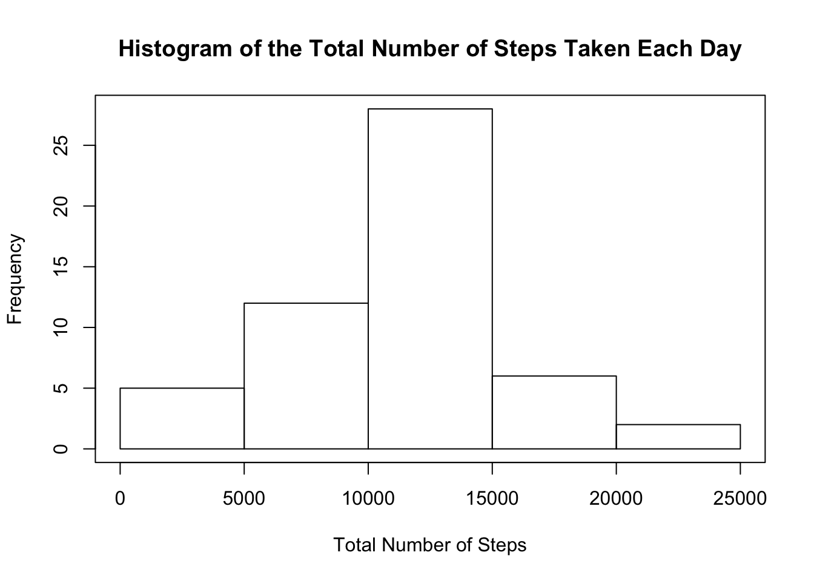
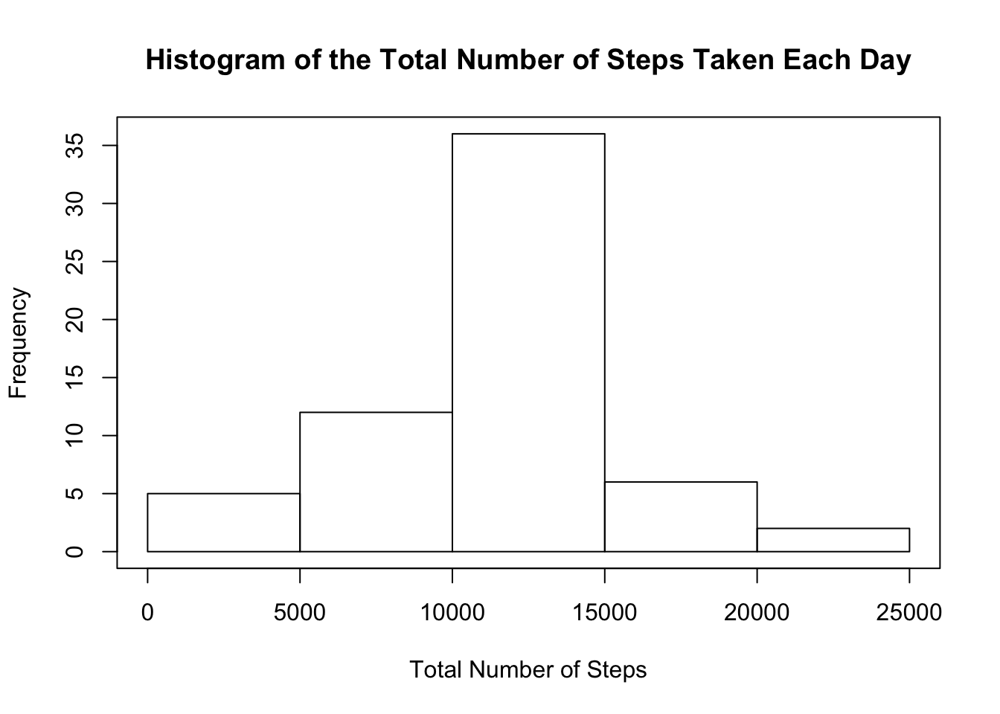
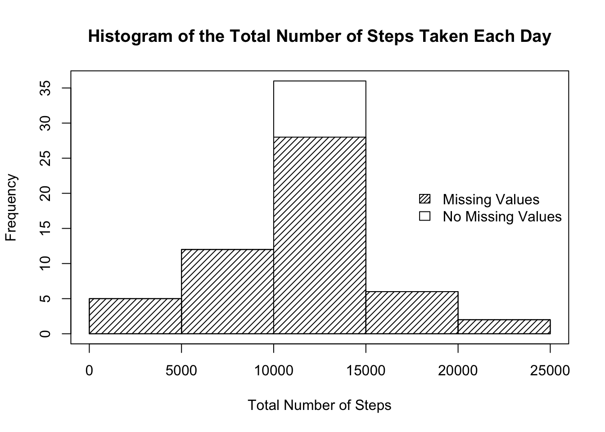
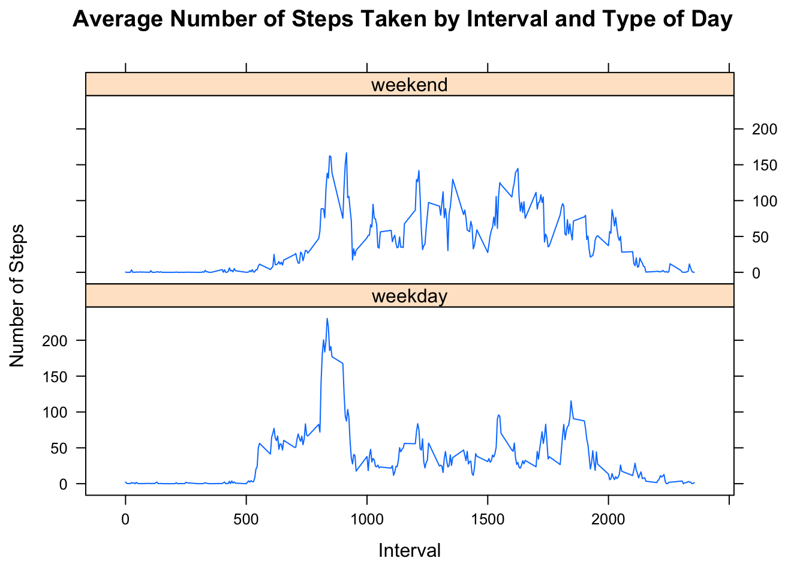

Reproducible Research: Peer Assessment 1
================

Loading and preprocessing the data
----------------------------------

``` r
activity <- read.csv("activity.csv")
```

What is the mean total number of steps taken per day?
-----------------------------------------------------

For this question, missing values in the dataset have been ignored.

A histogram showing the total number of steps taken each day:

``` r
stepsByDate <- aggregate(steps ~ date, data = activity, sum)

hist(x = stepsByDate$steps,
     xlab = "Total Number of Steps",
     main = "Histogram of the Total Number of Steps Taken Each Day")

box()
```



The mean and median total number of steps taken per day:

``` r
mean(stepsByDate$steps)
```

    ## [1] 10766.19

``` r
median(stepsByDate$steps)
```

    ## [1] 10765

What is the average daily activity pattern?
-------------------------------------------

A time series plot of the 5-minute interval and average number of steps taken, averaged across all days:

``` r
stepsByInterval <- aggregate(steps ~ interval, data = activity, mean)

plot(x = stepsByInterval$interval,
     y = stepsByInterval$steps,
     type = "l",
     xlab = "Interval",
     ylab = "Number of Steps",
     main = "Average Number of Steps Taken by Interval")
```


On average across all the days in the dataset, the 5-minute interval that contains the maximum number of steps is below:

``` r
stepsByInterval[which.max(stepsByInterval$steps),]
```

    ##     interval    steps
    ## 104      835 206.1698

Imputing missing values
-----------------------

Note that there are a number of days/intervals where there are missing values (coded as NA). The presence of missing days may introduce bias into some calculations or summaries of the data.

The total number of missing values in the dataset is below:

``` r
sum(is.na(activity))
```

    ## [1] 2304

The missing values have been replaced with the mean for the corresponding 5-minute interval and stored in a new dataset.

``` r
activityImputed <- activity

for(i in 1:nrow(activityImputed)) {
    
    if (is.na(activityImputed$steps[i])) {
        
        activityImputed$steps[i] <-
            stepsByInterval$steps[stepsByInterval$interval ==
                                      activityImputed$interval[i]]
        
    }
}
```

A histogram of the total number of steps taken each day in the revised dataset:

``` r
stepsByDateImputed <- aggregate(steps ~ date, data = activityImputed, sum)

hist(x = stepsByDateImputed$steps,
     xlab = "Total Number of Steps",
     main = "Histogram of the Total Number of Steps Taken Each Day")

box()
```



The mean and median total number of steps taken per day in the revised dataset:

``` r
mean(stepsByDateImputed$steps)
```

    ## [1] 10766.19

``` r
median(stepsByDateImputed$steps)
```

    ## [1] 10766.19

Comparing the mean and median in the revised dataset to the original, you can see that the mean remains the same, but the median has increased.

``` r
hist(x = stepsByDateImputed$steps,
     xlab = "Total Number of Steps",
     main = "Histogram of the Total Number of Steps Taken Each Day")

hist(x = stepsByDate$steps,
     add=T,
     density = 20)

legend("right",
       legend = c("Missing Values","No Missing Values"),
       density = c(30,0),
       bty = "n")

box()
```



Are there differences in activity patterns between weekdays and weekends?
-------------------------------------------------------------------------

Yes, as you can see in the plot below there are differences in activity patterns between weekdays and weekends.

``` r
library(lattice)

activityImputed$day <- weekdays(as.Date(activityImputed$date))
activityImputed$day[activityImputed$day %in% c("Saturday", "Sunday")] <- "weekend"
activityImputed$day[!(activityImputed$day %in% "weekend")] <- "weekday"

stepsByIntervalDay <- aggregate(steps ~ interval + day, data = activityImputed, mean)

xyplot(steps ~ interval | day,
       type = "l",
       data = stepsByIntervalDay,
       layout = c(1,2),
       xlab = "Interval",
       ylab = "Number of Steps",
       main = "Average Number of Steps Taken by Interval and Type of Day")
```


